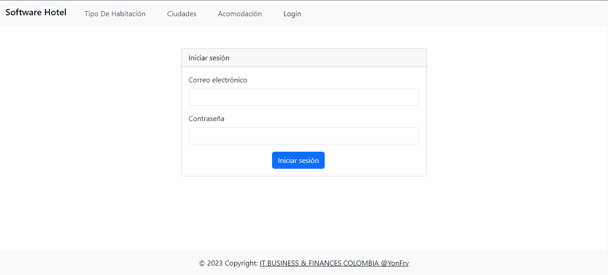
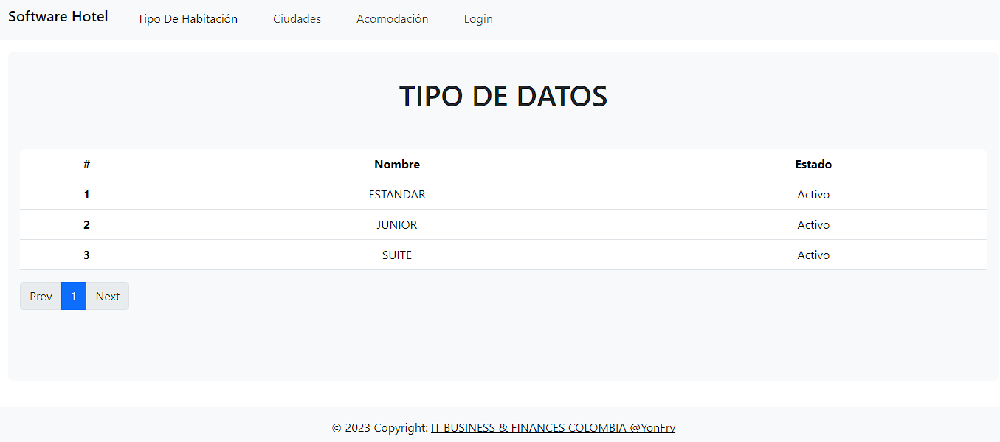
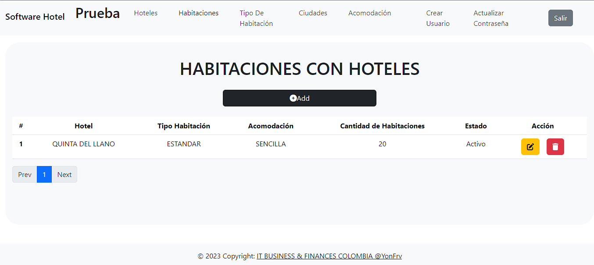

# Frontend Vue 3 for Hotel Management System

This Vue 3 frontend project integrates with the hotel management system developed in Laravel and allows users to manage hotel information and their room types.

# Main Features

- Consumption of Laravel Services: The frontend connects to the API provided by the Laravel backend to access and modify the information of the hotels and their room types.

- Intuitive User Interface: The user interface has been designed intuitively to facilitate navigation and management of system data.

- Data Visualization: Hotel and room type data is presented in a clear and organized manner for easy understanding.

# System Requirements

Make sure you have the following requirements in your development environment:

- Node.js >= 12
- Vue.js >= 3
- A local development server or access to a production server running the Laravel backend.

# Installation and Use
- Clone the GitHub repository:

      git clone https://github.com/YONFRV/HotelSoftVUE3

- Navigate to the Vue project directory:

      cd HotelSoftVUE3

- Install dependencies using npm or yarn:

       npm install
       yarn install

- Copy the example configuration file:

      cp .env.example .env

   Set environment variables in the .env file as needed, such as the Laravel API URL.

- Start the development server:

       npm install
       yarn install

    Open your browser and access the application at http://localhost:8080.

# Laravel API Configuration

Make sure the Laravel API URL is set correctly in the Vue app's src/main.js file. This URL should point to the location of your Laravel server. For example:

     window.axios.defaults.baseURL = 'http://localhost:8000/api'
# Use of the Application

Once the Vue app is up and running, you can use it to:

- View detailed information about hotels and room types.
- Add, edit or delete hotels and room types.
- Perform searches and filter information according to your needs.

# Contribute 
If you would like to contribute to this project, feel free to open issues or submit pull requests in the GitHub repository.

# License
This Vue 3 frontend project is under the MIT License. See the LICENSE file for more details.

annexes

